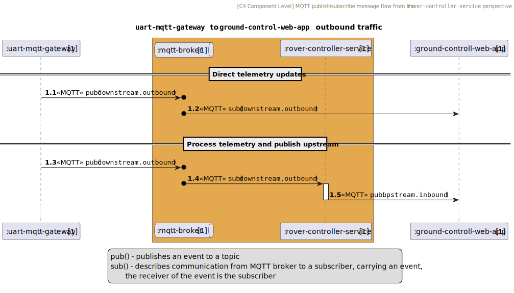
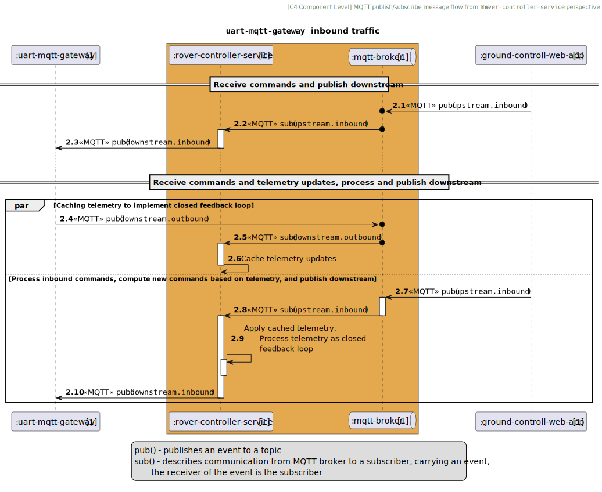

# Overview

This document specifies a list of requirements for the `rover-controller-service` project.
The application is meant to link close to real-time event processing to remotely control
a robotic platform.

The platform comprises modules such as chassis, manipulator, science and power.
`The rover-controller-service` aggregates each hardware module and implements corresponding
behavior as described in [Functional requirements section](#functional-requirements).

# Tech stack

* [Java 21](https://docs.oracle.com/en/java/javase/21/): A programming language of choice
* [Spring Boot](https://spring.io/projects/spring-boot): A comprehensive application framework
* [Spring Actuator](https://docs.spring.io/spring-boot/docs): This is to assure the service is always alive
* [Hive MQTT Library](https://github.com/hivemq/hivemq-mqtt-client-java): MQTT asynchronous library for Java
* [SL4J](https://www.slf4j.org/): A logging wrapper for Java
* [Mockito](https://site.mockito.org/): Mocking framework for unit testing in Java
* [Testcontainers](https://testcontainers.org/): Integration tests for MQTT

# Non-functional Requirements
The key words "MUST", "MUST NOT", "REQUIRED", "SHALL", "SHALL NOT", "SHOULD", 
"SHOULD NOT", "RECOMMENDED", "MAY", and "OPTIONAL" in this document are to be 
interpreted as described in [RFC 2119](https://tools.ietf.org/html/rfc2119).

## General

* MQTT client shall be configured as globally accessible bean for any service within the project
* MQTT shall be configured by following this YAML pattern:
```
mqtt:
    client-id: rover-controller-service
    broker:
        url: localhost
        port: 1883
        username: ${MQTT_USERNAME}
        password: ${MQTT_PASSWORD}
    connection:
        timeout.ms: 5000
        keepalive.ms: 60000
        reconnect.delay.ms: 5000
```
* MQTT username and password shall be passed as environment variables
* The application must expose and endpoint to monitor liveness and readiness of the application
* Application readiness must be defined as: all beans have been created and MQTT connection
is established
* Application liveness must be defined as: the application maintains connectivity with MQTT broker
* The application shall use `mqtt://` protocol by default
* Garbage collector shall be tuned for the lowest possible latency

## Testing

* Every public method in controllers, services shall be tested
* Every other method but public should be tested, yet it is by case-by-case basis
* Integration testing shall verify both inbound and outbound traffic flows
* Integration testing shall rely on testcontainers to deploy a mock MQTT server
* Integration testing shall rely on a custom Java bean to create an `MqttClient` for testing purposes

# Functional requirements

Configuration fields in `rover-controller-service` must be defined as follows:
* Whenever `downstream.inbound` topic is mentioned, the application shall publish to it
* Whenever `downstream.outbound` topic is mentioned, the application shall subscribe to it
* Whenever `upstream.inbound` topic is mentioned, the application shall subscribe to it
* Whenever `upstream.outbound` topic is mentioned, the application shall publish to it

Template (follow *integration requirements* sections below for more details):
```
<<business-category>>:
    eventType: <<category-name>>
    downstream:
        inbound: template/topic/name/inbound
        outbound: template/topic/name/outbound
    upstream:
        inbound: template/topic/name/controller/inbound
        outbound: template/topic/name/controller/outbound
```

<table>
    <tr>
        <th> System outbound traffic </th>
        <th> System inbound traffic </th>
    </tr>
    <tr>
        <td>


        </td>
        <td>


        </td>
    </tr>
</table>

## Chassis integration requirements


* The hardware chassis shall be equipped with 4 fixed wheels, each paired on the same axle.
* The hardware chassis shall support only [differential drive](https://en.wikipedia.org/wiki/Differential_drive) as a way to locomote.
* The chassis must be equipped with encoders, to read angular velocity of each wheel.

### Payloads

#### Inbound payload

* The application shall receive the following payload from the topic configured under  
`chassis.upstream.inbound`:

```
{
  "eventType": "chassis",
  "payload": {
    "stick": [x_value_real, y_value_real],
    "button_x": true|false,
    "button_y": true|false,
    "button_a": true|false,
    "button_b": true|false,
    "rotate": [z_value_real]
  }
}
```

| field | type | value range | description |
| --- | --- | --- | --- |
| payload.stick[0] | double | [-1.0, 1.0] | Turn [left, right]. Value '-1' sets maximum value to turn right, '0' - stop turning, '1' - maximum value to turn left |
| payload.stick[1] | double | [-1.0, 1.0] | Turn [forward, backward]. Value '-1' sets maximum value to drive forward, '0' - stop completely, '1' - maximum value to drive backward |
| payload.rotate | double | [-1.0, 1.0] | Turn in-place [left, right]. Value '-1' sets the maximum value to turn left, '0' - stop turning, '1' - maximum value to turn right |
| payload.button_(x\|y\|a\|b) | boolean | true|false | Not implemented yet | 

#### Outbound payloads

* Outbound payloads shall be strictly linked with the [operational modes](#operational-modes)
the robot is set up with


### Operational modes
* The application shall three distinct operational modes:

    * **PWM Mode**: Receives a command from the upstream, remaps it onto PWM values for each
wheel and send downstream 
    * **CFL Mode** (Closed Feedback Loop): Receives a command from the upstream, remaps it into 
angular velocity values for each wheel and sends downstream
    * **ROS Mode**: Receives a command from the upstream, remaps it into a ROS-compatible 
[Twist](https://docs.ros.org/en/foxy/api/geometry_msgs/html/msg/Twist.html) message-like 
messages with linear and angular velocity for precise rover control,
including slip compensation and terrain adaptation

* The application shall support more modes in future
* Operational modes shall be swappable in realtime, which will be suppoted by 
[strategy pattern](https://en.wikipedia.org/wiki/Strategy_pattern).


#### Chassis operational mode: PWM Mode

* The application shall map the inbound payload to the outbound payload by applying the
control principles formed in the table below:

| Input X | Input Y | Left PWM | Right PWM | Behavior |
| :-- | :-- | :-- | :-- | :-- |
| 0 | 1 | 255 | 255 | Full speed forward |
| 0 | -1 | -255 | -255 | Full speed backward |
| -1 | 0 | -255 | 255 | In-place left rotation |
| 1 | 0 | 255 | -255 | In-place right rotation |
| 0 | 0 | 0 | 0 | No movement |
| -1 | 0 | 0 | 0 | No movement |
| 0 | -1 | 0 | 0 | No movement |
| -0.3 | 0.7 | 101 | 255 | Forward with gentle left curve |
| 0.3 | 0.7 | 255 | 101 | Forward with gentle right curve |
| -0.7 | 0.7 | 0 | 255 | Sharp left turn (left wheels stopped) |
| 0.7 | 0.7 | 255 | 0 | Sharp right turn (right wheels stopped) |

##### PWM Mode: outbound payload
```
{
 "eventType": "chassis",    // chassis telemetry unique firmware identifier
 "mode": "pwm",             // operational mode: PWM
 "payload": {
    "fl": "<<int16>>",      // front-left wheel PWM in range [-255, 255]
    "fr": "<<int16>>",      // front-right wheel PWM in range [-255, 255]
    "rl": "<<int16>>",      // rear-left wheel PWM in range [-255, 255]
    "rr": "<<int16>>"       // rear-right wheel PWM in range [-255, 255]
 }
}
```

#### Chassis operational mode: CFL Mode

CFL Mode requirements: TBD 
##### CFL Mode: Outbound payload

```
{
 "eventType": "chassis",    // chassis telemetry unique firmware identifier
 "mode": "CFL",             // operational mode: CFL
 "payload": {
    "fl": ""<<double>>",    // front-left wheel angular velocity in rad/s
    "fr": ""<<double>>",    // front-right wheel angular velocity in rad/s
    "rl": ""<<double>>",    // rear-left wheel angular velocity in rad/s
    "rr": ""<<double>>"     // rear-right wheel angular velocity in rad/s
 }
}
```

#### Chassis operational mode: ROS Mode

CFL Mode requirements: TBD 

##### ROS Mode: Outbound payload
```
{
 "eventType": "chassis",    // chassis telemetry unique firmware identifier
 "mode": "ROS",             // operational mode: ROS
 "payload": {
    "linear": [<<double>>, <<double>>, <<double>>],     //Vector3 (x, y, z) expressed in m/s
    "angular": [<<double>>, <<double>>, <<double>>]     //Vector3 (x, y, z) expressed in rad/s
 }
}
```

### Chassis integration: application.yml configuration

```
chassis:
    eventType: chassis
    downstream:
        inbound: orion/topic/chassis/inbound
        outbound: orion/topic/chassis/outbound
    upstream:
        inbound: orion/topic/chassis/controller/inbound
```        

## Manipulator integration requirements

* Manipulator shall use the following MQTT topics configuration for inbound and outbound traffic:

```
manipulator:
    eventType: manipulator
    downstream:
        inbound: orion/topic/manipulator/inbound
        outbound: orion/topic/manipulator/outbound
    upstream:
        inbound: 
```

## Science integration requirements